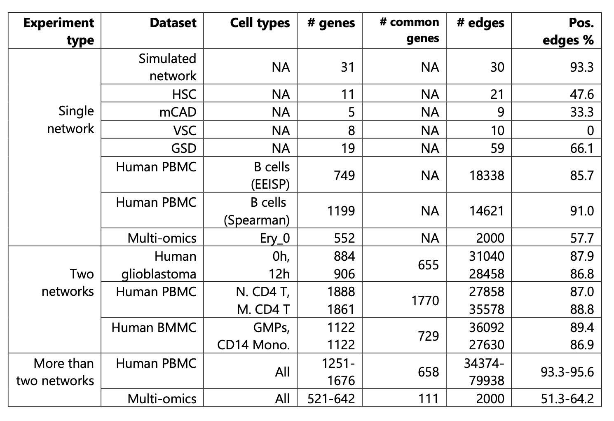

# Gene2role
Hi! This repository contains the code for our paper “Gene2role: A Role-Based Gene Embedding Method for Comparative Analysis of Signed Gene Regulatory Networks.” You can read the paper on BioRxiv: https://www.biorxiv.org/content/10.1101/2024.05.18.594807v1.abstract.

The repository is organized into two main sections:

	1.	Tutorial for Gene2role
	2.	Reproduction of the Paper’s Results

# Tutorial


## folder structure:

- pipeline.py
- tools
  - [SignedS2V](https://github.com/liushu2019/SignedS2V)
- codes
  - split_cells.py
  - spearman.py
  - eeisp.py

## command line
```
python pipeline.py TaskMode CellType EmbeddingMode input [**]

TaskMode.      1: run SignedS2V for an edgelist file. 
               2: run spearman and SignedS2V from gene X cell count matrix. 
               3: run eeisp and SignedS2V from gene X cell count matrix.
CellType.      1: single cell-type. 
               2: multiple cell-type.
EmbeddingMode. 1: single network embedding. 
               2: multiple network embedding, only work if the previous argument is 2.
input          Input file, either a gene X cell matrix for TaskMode 2 and 3, or edgelist for TaskMode 1.

Other arguments, check "python pipeline.py --help"
```
## Exp:
```
python pipeline.py 3 2 1 data/singleCell/test_rna/count.csv --project TEST321 --OPT1 --OPT2 --OPT3 --workers 61 --until_layer 1 --threCDI 0.0001 --threEEI 0.0001 --cell_metadata data/singleCell/test_rna/metadata.csv 
```
## Parameter combination
```
TBD
```

# Reproduction 

All the processed data generated in the paper can be downloaded from https://figshare.com/articles/dataset/data/25852915. 

The basic information about the data we used is as follows:


## Gene2role hyperparameters
We used Gene2role to generate embedding by the following hyperparameters using the `pipeline.py` mention above.

### Result 1
1. One simulated and four curated networks.
   - Task mode: 1 1 1
2. Single-cell RNA-seq network generated from B cell in human PBMC dataset
   - EEISP task mode: 3 1 1
   - spearman task mode: 2 1 1
3. Single-cell multi-omics network generated from Ery_0 stat in multi-omics networks.
   - 1 1 1	   
### Result 2
1. Human glioblastoma dataset.
   - Task mode: 3 2 2
2. CD4 cells from PBMC dataset.
   - Task mode: 3 2 2
3. Human BMMC dataset.
   - Task mode: 3 2 2  
### Result 3
1. Human PBMC dataset.
   - Task mode: 3 2 2
2. single-cell multi-omics dataset.
   - Task mode: 1 2 2
### Result 4
The codes for clustering genes using lovain algorithm can be found in **XXXX**.
We used the embeddings generated previously to analyze the gene module stability.
Specifically, for human glioblastoma dataset, we used the embedding generated in **Result 2**. And for single-cell multi-omics dataset, we used the embedding generated in **Result 3**
## Downstream analysis
The codes for downstream analyzed of the embeddings can be found in `reprodoce` accordingly.

# Contact
Feel free to reach Xin Zeng (wstxinzeng@gmail) and Shu Liu (Shu.liu.eq@gmail.com)to request files and more details from the analysis process!
