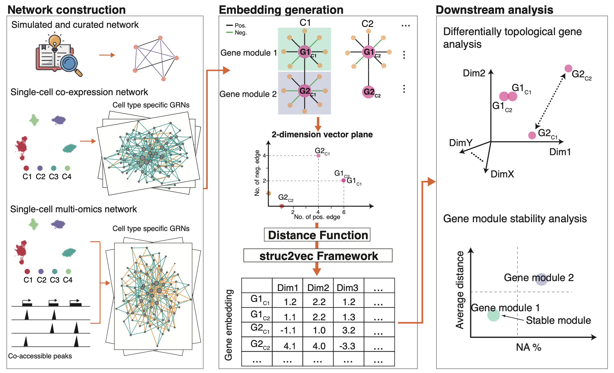

# Gene2role
Hi! This repository contains the code for our paper “Gene2role: A Role-Based Gene Embedding Method for Comparative Analysis of Signed Gene Regulatory Networks.” You can read the paper on BioRxiv: https://www.biorxiv.org/content/10.1101/2024.05.18.594807v1.abstract.

The repository is organized into two main sections:

	1.	Tutorial for Gene2role
	2.	Reproduction of the Paper’s Results

# Tutorial


## folder structure:

- pipeline.py
- tools/
  - [SignedS2V](https://github.com/liushu2019/SignedS2V)
- codes/
  - eeisp.py
  - merge_edgelist.py
  - spearman.py
  - split_cells.py

## command line
```
python pipeline.py TaskMode CellType EmbeddingMode input [**]

TaskMode.      1: run SignedS2V for an edgelist file. 
               2: run spearman and SignedS2V from gene X cell count matrix. 
               3: run eeisp and SignedS2V from gene X cell count matrix.
CellType.      1: single cell-type. 
               2: multiple cell-type.
EmbeddingMode. 1: single network embedding. 
               2: multiple network embedding, only work if the previous argument is 2.
input          Input file, either a gene X cell matrix for TaskMode 2 and 3, or edgelist for TaskMode 1.

Other arguments, check "python pipeline.py --help"
```
## Quick Example:
```
python pipeline.py 3 2 1 data/singleCell/test_rna/count.csv --project TEST321 --OPT1 --OPT2 --OPT3 --workers 61 --until_layer 1 --threCDI 0.0001 --threEEI 0.0001 --cell_metadata data/singleCell/test_rna/metadata.csv 
```

## Common Usage

### 1. Generating Embedding Representations for a Single GRN
If you have a single GRN and want to generate embedding representations, use the following basic command:

```
python pipeline.py 1 1 1 your_edgelist
```

### 2. Generating Embedding Representations for Multiple GRNs Simultaneously
If you have two or more GRNs and want to generate embedding representations simultaneously, use the following basic command:

```
python pipeline.py 1 2 2 your_edgelist1 your_edgelist2 your_edgelistx
```

### 3. Constructing GRN using EEISP/Spearman Correlation and Generating Embedding Representations for a Single Cell Type
If you have a gene X cell count matrix, want to construct a GRN , and generate embedding representations for a single cell type, use the following basic command:
EEISP (recommended):
```
python pipeline.py 3 1 1 your_count_matrix --threCDI 0.5 --threEEI 0.5
```
Spearman:
```
python pipeline.py 2 1 1 your_count_matrix --correlation_threshold 0.4
```


### 4. Constructing GRN using EEISP/Spearman Correlation and Generating Embedding Representations for Multiple Cell Types
If you have a gene X cell count matrix, want to construct GRNs, and generate embedding representations for multiple cell types, use the following basic command:

EEISP (recommended):
```
python pipeline.py 3 2 2 your_count_matrix --cell_metadata your_cell_metadata --threCDI 0.5 --threEEI 0.5
```
Spearman:
```
python pipeline.py 2 2 2 your_count_matrix --cell_metadata your_cell_metadata --correlation_threshold 0.4
```

Note: Replace `your_edgelist`, `your_count_matrix`, `your_cell_metadata`, and other placeholders with the actual file names or paths corresponding to your data.

`your_edgelist` is a TSV file representing the GRN with three columns, which are geneID1, geneID2, and edge sign (1/-1). The number of rows indicates the number of edges in the GRN.

`your_count_matrix` is a CSV file representing the Gene X Cell count matrix. Columns are cells, and rows are genes. The value indicates the gene expression level.

`your_cell_metadata` is a CSV file showing the relationship between cells and cell types. Columns are information about cells, and rows are cells. Two columns are required: [orig.ident] and [celltype]. [orig.ident] indicates the cell ID and must be aligned with the column names in `your_count_matrix`. [celltype] indicates the cell type of the cell.

# Reproduction 

All the processed data generated in the paper can be downloaded from https://figshare.com/articles/dataset/data/25852915. 

The basic information about the data we used is as follows:


## Gene2role hyperparameters
We used Gene2role to generate embedding by the following hyperparameters using the `pipeline.py` mention above.

### Result 1
1. One simulated and four curated networks.
   - Task mode: 1 1 1
2. Single-cell RNA-seq network generated from B cell in human PBMC dataset
   - EEISP task mode: 3 1 1
   - spearman task mode: 2 1 1
3. Single-cell multi-omics network generated from Ery_0 stat in multi-omics networks.
   - 1 1 1	   
### Result 2
1. Human glioblastoma dataset.
   - Task mode: 3 2 2
2. CD4 cells from PBMC dataset.
   - Task mode: 3 2 2
3. Human BMMC dataset.
   - Task mode: 3 2 2  
### Result 3
1. Human PBMC dataset.
   - Task mode: 3 2 2
2. single-cell multi-omics dataset.
   - Task mode: 1 2 2
### Result 4
The codes for clustering genes using lovain algorithm can be found in **[URL](https://python-louvain.readthedocs.io/en/latest/)**.
We used the embeddings generated previously to analyze the gene module stability.
Specifically, for human glioblastoma dataset, we used the embedding generated in **Result 2**. And for single-cell multi-omics dataset, we used the embedding generated in **Result 3**
## Downstream analysis
The codes for downstream analyzed of the embeddings can be found in `reprodoce` accordingly.

# Contact
Feel free to reach Xin Zeng (wstxinzeng@gmail) and Shu Liu (Shu.liu.eq@gmail.com)to request files and more details from the analysis process!

# License
This project is licensed under the MIT License.

MIT License

Copyright (c) 2024 Shu Liu

Permission is hereby granted, free of charge, to any person obtaining a copy
of this software and associated documentation files (the "Software"), to deal
in the Software without restriction, including without limitation the rights
to use, copy, modify, merge, publish, distribute, sublicense, and/or sell
copies of the Software, and to permit persons to whom the Software is
furnished to do so, subject to the following conditions:

The above copyright notice and this permission notice shall be included in all
copies or substantial portions of the Software.

THE SOFTWARE IS PROVIDED "AS IS", WITHOUT WARRANTY OF ANY KIND, EXPRESS OR
IMPLIED, INCLUDING BUT NOT LIMITED TO THE WARRANTIES OF MERCHANTABILITY,
FITNESS FOR A PARTICULAR PURPOSE AND NONINFRINGEMENT. IN NO EVENT SHALL THE
AUTHORS OR COPYRIGHT HOLDERS BE LIABLE FOR ANY CLAIM, DAMAGES OR OTHER
LIABILITY, WHETHER IN AN ACTION OF CONTRACT, TORT OR OTHERWISE, ARISING FROM,
OUT OF OR IN CONNECTION WITH THE SOFTWARE OR THE USE OR OTHER DEALINGS IN THE
SOFTWARE.
